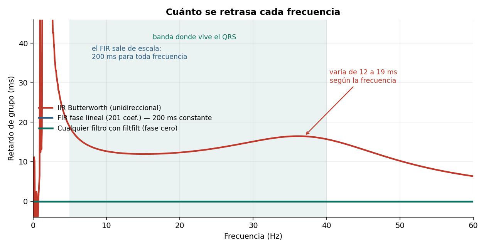
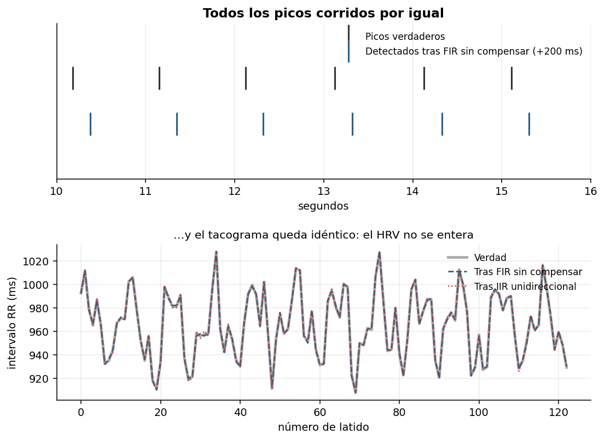
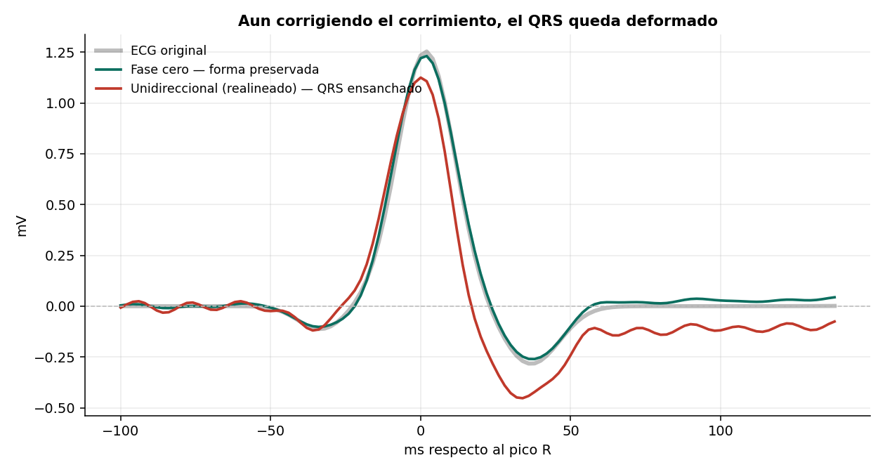

# El retardo del filtro no arruina tu HRV (pero sí el ancho del QRS)

Medición del efecto del retardo de grupo sobre dos tipos de análisis de ECG: métricas de
variabilidad cardiaca (entre latidos) e intervalos morfológicos (dentro del latido).



## Resultado principal

La advertencia habitual —"usa `filtfilt` o el retardo arruinará tu HRV"— llega a la
conclusión correcta por el motivo equivocado.

| Método | Corrimiento | Jitter | SDNN | RMSSD |
|---|---|---|---|---|
| **Verdad** | — | — | **27.77** | **27.49** |
| IIR unidireccional | 10.25 ms | 0.70 ms | 27.89 | 27.74 |
| IIR fase cero | −0.00 ms | 0.56 ms | 27.81 | 27.63 |
| FIR sin compensar | +200 ms | — | 27.80 | 27.61 |

Un FIR de fase lineal corre **todos** los picos 200 ms y devuelve un SDNN de 27.80 contra
27.77 de la verdad. El HRV se calcula sobre diferencias entre picos consecutivos, así que
un corrimiento común se cancela:

```
(t[i+1] + Δ) − (t[i] + Δ) = t[i+1] − t[i]
```

Un retardo constante es invisible para el HRV, sea de 10 ms o de 200.



## Dónde sí importa el retardo

Las mediciones **dentro** de un mismo latido no tienen resta que cancele nada.

| Método | Ancho QRS medido | Error |
|---|---|---|
| Señal original | 44.5 ms | — |
| IIR unidireccional | 63.8 ms | **+19.3 ms** |
| IIR fase cero | 44.1 ms | −0.4 ms |

El filtrado unidireccional ensancha el QRS 19 ms. El umbral clínico de QRS ancho es
120 ms (criterio de bloqueo de rama), de modo que un caso limítrofe puede cruzarlo por
efecto del filtro.

Esto **no se corrige realineando**: la deformación está dentro del latido.



La causa está en la primera figura: el IIR retrasa entre 12 y 18.7 ms según la frecuencia
—casi 7 ms de dispersión dentro de la banda del QRS— y esa dispersión reparte en el tiempo
lo que debería estar concentrado.

## Recomendación

| Situación | Filtro | Por qué |
|---|---|---|
| Análisis diferido | `filtfilt` | Fase cero: sin deformación ni retardo |
| Tiempo real con medición de intervalos | FIR de fase lineal | Retardo constante y conocido, compensable |
| Tiempo real, solo detectar latidos | IIR unidireccional | Barato, y el retardo no afecta al HRV |

`filtfilt` no es aplicable en tiempo real porque requiere muestras futuras. Un FIR de fase
lineal introduce un retardo de (N−1)/2 muestras, exactamente conocido y descontable, a
costa de un orden mucho mayor: 201 coeficientes frente a 8 del IIR.

## Contenido

```
notebooks/retardo_grupo.ipynb   Notebook completo, ejecutable de principio a fin
src/ecghrv.py                   Generador de ECG con HRV realista y métricas
figuras/                        Figuras generadas
```

## Reproducir

```bash
git clone https://github.com/USUARIO/ecg-retardo-grupo.git
cd ecg-retardo-grupo
pip install -r requirements.txt
jupyter lab notebooks/retardo_grupo.ipynb
```

No requiere descargar datos: la señal se genera dentro del notebook.

## Metodología

El generador produce una serie RR con componentes de baja y alta frecuencia más ruido, y
modula la amplitud y anchura de cada latido con la respiración, de modo que la morfología
cambie ligeramente entre latidos. Sin esa modulación el jitter sería idénticamente cero y
la comparación no tendría sentido.

Todos los métodos usan el mismo detector de picos R, de modo que las diferencias se
atribuyan al filtro y no al detector.

## Limitaciones

El jitter medido depende del detector; la conclusión sobre el retardo constante no,
porque es aritmética.

El ensanchamiento de 19 ms corresponde a un Butterworth de orden 4 con banda 0.5–40 Hz.
Otros diseños dan otras magnitudes; la dirección del efecto no cambia.

No se midió el intervalo QT. El método de detección del final de la onda T resultó
dominado por la deformación que el paso-alto de 0.5 Hz introduce en la onda T, y no
discriminaba entre filtrados. Requiere el método de la tangente.

## Referencias

- Kligfield P. et al. *Recommendations for the Standardization and Interpretation of the Electrocardiogram, Part I.* Circulation, 2007.
- Task Force of the ESC and NASPE. *Heart rate variability: standards of measurement, physiological interpretation, and clinical use.* Circulation, 1996.
- Oppenheim A., Schafer R. *Discrete-Time Signal Processing.*

## Licencia

MIT — ver [LICENSE](LICENSE).
